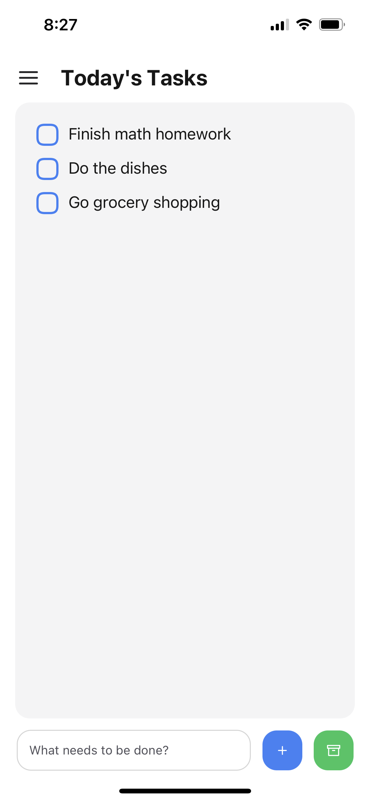
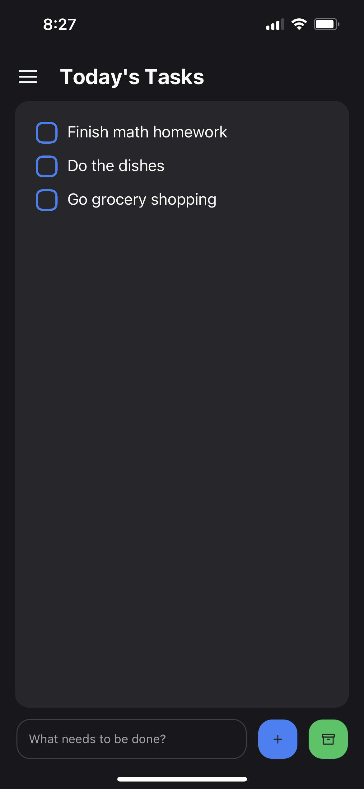
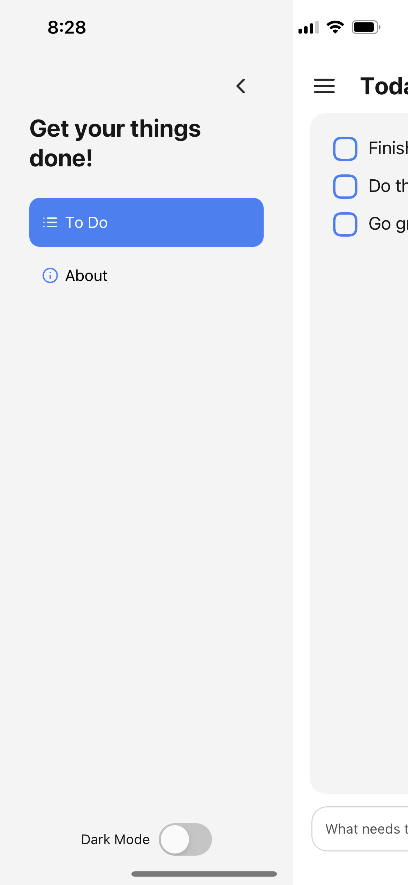
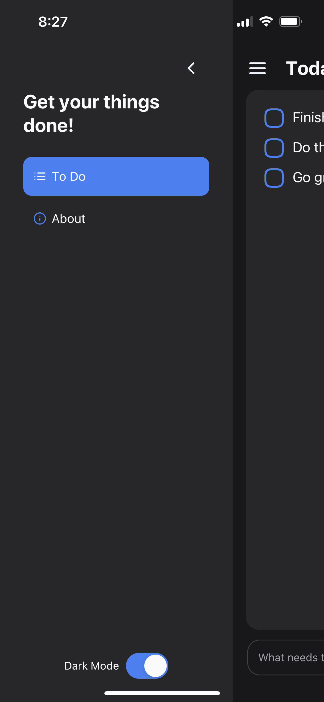

# fancy-todolist

A simple todo list app that I made to get to get my life in line. Also to learn how React Native works.

## Made with:

- [React Native](https://reactnative.dev/)
- [Expo](https://expo.dev/)
- [React Navigation](https://reactnavigation.org/)
- [Nativebase](https://nativebase.io/)
- [React Native Reanimated](https://github.com/software-mansion/react-native-reanimated)
- [react-native-checkbox-reanimated](https://github.com/craftzdog/react-native-checkbox-reanimated)

## How to run (in directory)

```
yarn install
yarn start
```

## Main Screen

<p align='left'>
  
  
</p>

## Navigation Screen (More to come when I don't feel angry at React Native)

<p align='left'>
  
  
</p>

### Credit:

- [Animated To Do Button](https://github.com/craftzdog/react-native-checkbox-reanimated)

I had an archive screen planned out but had to redesign the app, so it's just in the works for now :)
